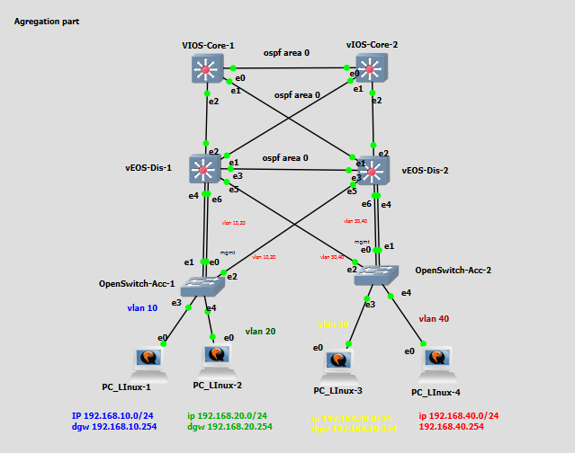

# Rapport sur l'Architecture Réseau GNS3 à Trois Niveaux

## Introduction
Dans ce rapport, nous allons discuter de l'architecture réseau mise en place dans l'environnement GNS3, en mettant l'accent sur une architecture à trois niveaux comprenant les couches d'accès, de distribution et de cœur.

## Architecture à Trois Niveaux
L'architecture à trois niveaux est une approche couramment utilisée pour concevoir des réseaux d'entreprise extensibles et évolutifs. Elle se compose des niveaux suivants :

### Couche d'Accès
La couche d'accès est la couche la plus basse de l'architecture et est responsable de la connectivité des périphériques finaux tels que les ordinateurs, les imprimantes et les téléphones IP. Dans notre configuration GNS3, cette couche est représentée par des commutateurs Ethernet.

### Couche de Distribution
La couche de distribution agit comme un pont entre la couche d'accès et la couche de cœur. Elle agrège le trafic provenant des commutateurs d'accès et fournit une connectivité aux différents VLAN et sous-réseaux. Dans notre configuration, nous avons déployé des routeurs au niveau de la couche de distribution pour assurer une connectivité inter-VLAN.

### Couche de Cœur
La couche de cœur est le cœur du réseau et est responsable de la commutation et du routage du trafic entre les différents sous-réseaux. Dans notre architecture GNS3, cette couche est représentée par des routeurs haut de gamme qui fournissent une connectivité entre les différentes zones du réseau.

## Configuration GNS3
Pour mettre en place cette architecture dans GNS3, nous avons utilisé les éléments suivants :
- Commutateurs Ethernet pour la couche d'accès
- Routeurs pour les couches de distribution et de cœur
- Connexions Ethernet pour interconnecter les différents éléments du réseau

## Conclusion
L'architecture réseau à trois niveaux est une approche efficace pour concevoir des réseaux d'entreprise évolutifs et fiables. Grâce à GNS3, nous avons pu simuler et tester cette architecture avant de la déployer dans un environnement de production.
xx

